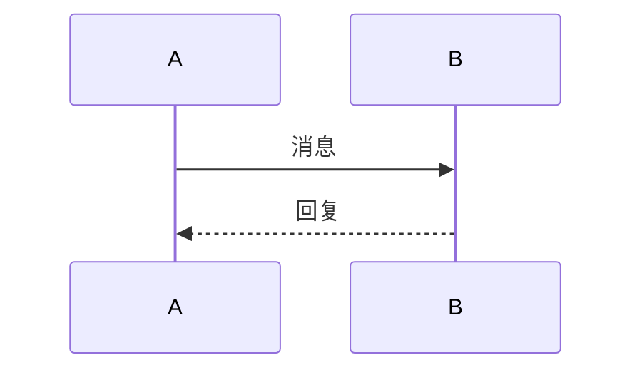

# Steve Blog - 个人博客系统

一个基于 Vue 3 + TypeScript + Vite 构建的现代化个人博客网站，支持多语言国际化、Markdown 文章渲染、评论功能、主题切换等特性，旨在为个人提供简洁、高效的博客展示平台。

## ✨ 核心特性

- 🌍 **多语言国际化** - 支持中英文等多语言切换，适配全球用户使用场景，可灵活扩展更多语种
- 📝 **Markdown 文章** - 支持 Markdown 格式文章渲染，包括标题、列表、代码块、引用、图片等
- 💬 **评论功能** - 支持文章评论，评论数据本地存储，可扩展后端接口
- 📱 **响应式设计** - 适配桌面端 / 移动端多终端使用，保证不同设备下的操作流畅度
- 🌓 **主题切换** - 支持深色/浅色主题切换，自动保存用户偏好
- 🚀 **高性能** - 基于 Vite 构建，按需加载，极致渲染性能
- 📚 **文章分类** - 支持文章分类筛选和排序功能
- 🔗 **目录导航** - 文章详情页自动生成目录，支持锚点跳转
- 🔍 **文章搜索** - 支持全文搜索，实时高亮匹配结果
- ✏️ **文章编辑** - 支持创建和编辑文章，提供封面预设和表单验证
- 📊 **图表支持** - 支持 Mermaid 图表和 Flowchart.js 流程图渲染
- 🧮 **数学公式** - 支持 LaTeX 数学公式渲染（行内和块级）
- 📋 **代码高亮** - 支持多种编程语言的语法高亮，提供一键复制功能

## 🛠️ 技术栈

| 技术 | 版本 | 说明 |
|:--------|:-------------|:---------------------|
| Vue | 3.5+ | 核心前端框架，基于 Composition API 构建 |
| TypeScript | 5.9+ | 类型安全开发，提升代码可维护性与可读性 |
| Vite | 7.2+ | 下一代构建工具，实现快速热更新与优化构建 |
| Pinia | 3.0+ | Vue 官方状态管理库，替代 Vuex，简化状态管理 |
| Vue Router | 4.6+ | 路由管理，支持动态路由、路由守卫与权限控制 |
| vue-i18n | 9.14+ | 国际化解决方案，支持语言切换、占位符插值、复数处理 |
| markdown-it | 14.1+ | Markdown 解析器，支持插件扩展，用于文章内容渲染 |
| highlight.js | 11.10+ | 代码语法高亮库，支持多种编程语言，集成到 markdown-it 中 |
| katex | 0.16+ | LaTeX 数学公式渲染库，快速、轻量级，支持行内和块级公式 |
| mermaid | 11.12+ | 图表和流程图渲染库，支持流程图、时序图、类图等多种图表类型 |
| flowchart.js | 1.18+ | 流程图渲染库，支持简单的流程图绘制 |

## 🚀 快速开始

### 环境要求

- Node.js ≥ 18.0.0（推荐 18.16.0 LTS）
- npm/yarn/pnpm（推荐 pnpm，提升依赖安装速度）
- 浏览器支持：Chrome 90+、Firefox 88+、Edge 90+、Safari 15+

### 安装依赖

```bash
# 克隆项目
git clone https://github.com/your-username/steve-blog.git

# 进入项目目录
cd steve-blog

# 安装依赖（pnpm优先）
pnpm install
# 若使用npm
npm install
# 若使用yarn
yarn install
```

### 本地开发

```bash
# 启动开发服务器（自动打开浏览器，支持热更新）
pnpm dev

# 访问地址（默认端口5173，若被占用自动切换）
http://localhost:5173
```

### 构建生产

```bash
# 构建生产包（自动优化代码、压缩资源、按需拆分）
pnpm build

# 预览生产构建（验证构建结果）
pnpm preview
```

## 📖 核心功能使用

### 国际化配置

项目基于 vue-i18n 实现多语言支持，默认支持中英双语，可扩展日语、韩语等更多语种：

- 语言切换即时生效，自动缓存用户偏好到本地存储
- 支持模板插值、复数形式、日期 / 数字格式化
- 支持组件内、全局、工具函数中多场景使用

**扩展新语言：**

1. 在 `src/locales/` 目录下新增语言文件（如 `ja.json` 日语）
2. 在 `src/i18n.ts` 中注册新语言
3. 在 `src/App.vue` 中添加语言切换逻辑

### 文章管理

项目使用 Markdown 文件作为文章来源，将 Markdown 文件放在项目根目录的 `content/` 目录下，系统会自动加载并显示。

**文件格式：**

支持可选的 YAML frontmatter：

```markdown
---
title: 文章标题
description: 文章描述
categoryKey: dit
tag: DiT
badge: New
date: 2025-12-16
platform: Wechat
cover: linear-gradient(135deg, #667eea 0%, #764ba2 100%)
---

# 文章内容

这里是 Markdown 格式的文章内容...
```

**Frontmatter 字段说明：**

- `title`: 文章标题（可选，如未提供则从文件名提取）
- `description`: 文章描述（可选，如未提供则从内容第一段提取）
- `categoryKey`: 文章分类（从国际化配置动态加载，如 `c/c++`, `linux`, `ROS`, `中间件`, `apollo` 等），默认：`c/c++`
- `tag`: 文章标签
- `badge`: 可选徽章（如 "Beta", "New" 等）
- `date`: 发布日期（YYYY-MM-DD 格式，可选，如未提供则从文件名提取或使用当前日期）
- `platform`: 发布平台，默认：Wechat
- `cover`: 封面背景（支持 CSS 渐变如 `linear-gradient(...)` 或图片 URL/base64 如 `data:image/...`）

**文件名格式：**

- `YYYY-MM-DD-title.md` - 包含日期和标题
- `title.md` - 仅包含标题

**特性：**

- ✅ 自动读取 `content/` 目录下的所有 `.md` 文件
- ✅ 支持 YAML frontmatter
- ✅ 从文件名自动提取日期和标题
- ✅ 自动提取文章描述（从内容第一段）
- ✅ 按日期自动排序（最新的在前）
- ✅ 构建时自动打包到构建产物中
- ✅ 构建时自动复制到 `dist/content` 目录
- ✅ 支持封面图片上传（base64 格式）
- ✅ 支持封面 CSS 渐变背景
- ✅ 分类从国际化配置动态加载

**文章操作：**

- 创建文章：访问 `/articles/new` 或点击"新建文章"按钮，创建后保存为 Markdown 文件
- 编辑文章：在文章详情页点击"编辑"按钮，或访问 `/articles/:id/edit`，编辑后更新 Markdown 文件
- 文章以 Markdown 文件形式存储在 `content/` 目录下

### Markdown 渲染

项目使用 markdown-it 插件进行 Markdown 解析，支持以下语法：

#### 基础语法

- **标题**（H1-H6，自动生成锚点 ID）
- **无序列表**和**有序列表**
- **引用块**
- **代码块**（支持语言标识，使用 highlight.js 进行语法高亮，支持一键复制）
- **行内代码**
- **粗体**、*斜体*文本
- **图片**（自动适配响应式）
- **链接**（自动识别 URL）
- **HTML 标签**（可选）
- **删除线**、**高亮标记**（`==标记文本==`）
- **表格**（带边框样式）
- **任务列表**（checkbox）

#### LaTeX 数学公式支持

项目使用 KaTeX 渲染 LaTeX 数学公式，支持行内公式和块级公式：

**行内公式**（使用单个 `$` 包裹）：
```markdown
这是一个行内公式：$E = mc^2$
```

**块级公式**（使用双 `$$` 包裹）：
```markdown
$$
\int_{-\infty}^{\infty} e^{-x^2} dx = \sqrt{\pi}
$$
```

**常用数学符号示例：**
- 分数：`$\frac{a}{b}$` → $\frac{a}{b}$
- 根号：`$\sqrt{x}$` → $\sqrt{x}$
- 上标和下标：`$x^2$`、`$x_i$` → $x^2$、$x_i$
- 求和：`$\sum_{i=1}^{n} x_i$` → $\sum_{i=1}^{n} x_i$
- 积分：`$\int_{a}^{b} f(x) dx$` → $\int_{a}^{b} f(x) dx$
- 矩阵：`$\begin{pmatrix} a & b \\ c & d \end{pmatrix}$`

更多语法请参考 [KaTeX 官方文档](https://katex.org/docs/supported.html)。

#### Mermaid 图表支持

项目支持 Mermaid 图表渲染，可以在 Markdown 中使用以下代码块语法：

````markdown

````

**支持的图表类型：**
- `mermaid` - 通用 Mermaid 图表
- `sequenceDiagram` - 时序图
- `classDiagram` - 类图
- `stateDiagram` - 状态图
- `erDiagram` - ER图
- `journey` - 用户旅程图
- `gantt` - 甘特图
- `pie` - 饼图
- `requirement` - 需求图
- `gitgraph` - Git 图
- `mindmap` - 思维导图
- `timeline` - 时间线

#### Flowchart.js 流程图支持

项目支持 Flowchart.js 流程图渲染，可以在 Markdown 中使用以下代码块语法：

````markdown
```flowchart
st=>start: 开始
e=>end: 结束
op=>operation: 操作
cond=>condition: 条件判断
st->op->cond
cond(yes)->e
cond(no)->op
```
````

**流程图语法：**
- `st=>start: 开始` - 开始节点
- `e=>end: 结束` - 结束节点
- `op=>operation: 操作` - 操作节点
- `cond=>condition: 条件判断` - 条件节点
- `io=>inputoutput: 输入输出` - 输入输出节点
- `sub=>subroutine: 子程序` - 子程序节点

更多语法请参考 [Flowchart.js 官方文档](https://flowchart.js.org/)。

### 评论功能

评论功能使用本地存储（localStorage）保存数据，可按文章 ID 分组管理。支持：

- 添加评论（昵称可选）
- 查看评论列表
- 评论时间显示
- 评论数据持久化

**扩展为后端 API：**

只需修改 `src/composables/useArticleComments.ts` 中的实现，将 localStorage 操作替换为 API 调用即可。

### 主题切换

项目支持深色/浅色主题切换，主题状态通过 Pinia 管理，自动保存到本地存储。

**主题切换方式：**
- 点击导航栏右侧的主题切换按钮（☀/☾）
- 主题状态会自动保存到 localStorage
- 页面刷新后自动恢复上次选择的主题

### 文章搜索

项目支持全文搜索功能，可以搜索文章标题、描述、内容、标签和分类。

**搜索特性：**
- 实时搜索，输入即搜索
- 高亮显示匹配结果
- 支持中文和英文搜索
- 搜索关键词会在标题和描述中高亮显示

## 📁 目录结构

```
steve-blog/
├── content/              # Markdown 文章文件目录
│   ├── example.md        # 示例文章
│   └── example1.md        # 示例文章
├── public/               # 静态资源（不会被Vite处理）
│   ├── 404.html          # 404错误页面
│   └── blog.svg          # 网站图标
├── src/
│   ├── assets/           # 静态资源（图片、样式、字体等，会被Vite处理）
│   │   └── vue.svg       # Vue Logo
│   ├── components/      # 通用组件
│   │   ├── article/      # 文章相关组件
│   │   │   ├── ArticleHeader.vue      # 文章头部组件（标题、元信息、操作按钮）
│   │   │   ├── ArticleContent.vue     # 文章内容组件（Markdown渲染、代码高亮）
│   │   │   ├── ArticleTOC.vue         # 目录导航组件（自动生成目录）
│   │   │   └── CommentSection.vue     # 评论区域组件（评论列表、添加评论）
│   │   └── home/         # 首页相关组件
│   │       ├── Section.vue           # 通用区块组件（带滚动动画）
│   │       ├── Card.vue               # 通用卡片组件（支持多种动画类型）
│   │       ├── SkillCategory.vue      # 技能分类组件
│   │       ├── ProjectCard.vue        # 项目卡片组件
│   │       └── EducationCard.vue       # 教育经历卡片组件
│   ├── composables/      # 组合式函数（逻辑复用）
│   │   ├── useArticleMarkdown.ts      # Markdown 解析逻辑
│   │   ├── useArticleComments.ts      # 评论管理逻辑
│   │   ├── useArticleEditor.ts        # 文章编辑逻辑（创建、更新、验证）
│   │   ├── useArticleSearch.ts        # 文章搜索逻辑（全文搜索、高亮）
│   │   ├── useCategories.ts           # 分类管理逻辑（从国际化配置动态加载）
│   │   ├── useCodeCopy.ts             # 代码复制功能
│   │   ├── useMermaidRenderer.ts      # Mermaid 图表渲染
│   │   └── useFlowchartRenderer.ts    # Flowchart 流程图渲染
│   ├── data/            # 数据文件
│   │   ├── types.ts     # 文章类型定义
│   │   ├── contentArticles.ts # 内容文章管理（Markdown文件）
│   │   └── index.ts     # 统一导出和合并接口
│   ├── locales/         # 国际化语言文件
│   │   ├── zh.json      # 中文语言包
│   │   └── en.json      # 英文语言包
│   ├── pages/           # 页面组件
│   │   ├── HomePage.vue         # 首页
│   │   ├── ArticlesPage.vue     # 文章列表页（分类筛选、搜索、排序）
│   │   ├── ArticleDetailPage.vue # 文章详情页（内容展示、评论、导航）
│   │   ├── ArticleEditPage.vue  # 文章编辑页（创建/编辑文章）
│   │   └── ContactPage.vue      # 联系页
│   ├── router/          # 路由配置
│   │   └── index.ts    # 路由定义（路径、组件、重定向）
│   ├── store/           # Pinia状态管理
│   │   ├── modules/     # 模块状态
│   │   │   └── app.ts   # 应用状态（主题切换）
│   │   └── index.ts    # Pinia实例创建
│   ├── utils/           # 工具函数
│   │   ├── html.ts     # HTML转义工具（XSS防护）
│   │   ├── frontmatter.ts  # Frontmatter 解析工具
│   │   ├── markdownLoader.ts  # Markdown 文件加载器
│   │   ├── markdownExporter.ts  # Markdown 文件导出工具
│   │   └── coverStyle.ts  # 封面样式工具（处理CSS渐变和图片）
│   ├── App.vue          # 根组件（导航栏、路由视图、主题切换）
│   ├── main.ts          # 入口文件（初始化Vue、路由、Pinia、i18n）
│   ├── i18n.ts          # 国际化配置
│   └── style.css        # 全局样式（主题变量、布局、组件样式）
├── vite-plugin-copy-content.ts  # Vite 插件：构建时复制 content 目录
├── vite-env.d.ts        # Vite 类型声明文件（@vitejs/plugin-vue 类型定义）
├── .eslintrc.js         # ESLint配置（代码规范）
├── .prettierrc.js       # Prettier配置（代码格式化）
├── tsconfig.json        # TypeScript配置
├── tsconfig.app.json    # TypeScript应用配置
├── tsconfig.node.json   # TypeScript Node配置
├── vite.config.ts       # Vite配置（插件、别名、构建优化、代码分割）
├── package.json         # 依赖配置与脚本命令
└── README.md            # 项目说明文档（本文档）
```

## 🗺️ 页面路由

| 路径 | 名称 | 说明 |
|:-----|:-----|:-----|
| `/` | - | 重定向到 `/articles` |
| `/home` | home | 首页 |
| `/articles` | articles | 文章列表页（支持分类筛选、搜索、排序） |
| `/articles/:id` | articleDetail | 文章详情页（显示文章内容、评论、目录） |
| `/articles/new` | articleNew | 新建文章页 |
| `/articles/:id/edit` | articleEdit | 编辑文章页 |
| `/contact` | contact | 联系页 |

## 💻 开发规范

### 代码风格

- 遵循 ESLint + Prettier 配置，提交前自动格式化
- 使用 2 空格缩进
- 使用单引号
- 行尾不加分号（由 Prettier 自动处理）

### TypeScript

- 强制使用类型定义，避免 `any` 类型（特殊情况需注释说明）
- 使用接口（interface）定义对象类型
- 使用类型别名（type）定义联合类型
- 优先使用组合式 API（Composition API）
- 类型声明文件：项目根目录的 `vite-env.d.ts` 用于声明第三方库的类型（如 `@vitejs/plugin-vue`）

### 组件开发

- 通用组件需编写文档注释，支持 Props 类型校验与默认值
- 组件命名使用 PascalCase
- 保持组件职责单一，复杂页面拆分为多个子组件
- 使用 `<script setup>` 语法

### 国际化

- 所有用户可见文本必须通过 `$t()` 函数，禁止硬编码
- 新增文本需要在 `src/locales/zh.json` 和 `src/locales/en.json` 中同时添加
- 使用命名空间组织翻译文本（如 `nav.home`, `article.title`）

### 样式规范

- 使用 CSS 变量定义主题颜色
- 使用 scoped 样式避免样式污染
- 响应式设计使用媒体查询
- 优先使用 Flexbox 和 Grid 布局

### Git 提交规范

- 使用有意义的提交信息
- 提交前运行 `pnpm build` 确保构建通过
- 提交前运行 ESLint 检查

## 🔧 构建优化

项目使用 Vite 进行构建优化，包括：

- **代码分割**：按需加载，减少初始加载时间
  - `vue-vendor`: Vue 核心库（vue, vue-router, pinia, vue-i18n）
  - `markdown-vendor`: Markdown 相关库
  - `highlight-vendor`: 代码高亮库
  - `math-vendor`: 数学公式和图表库

- **资源优化**：自动压缩和优化静态资源
- **Tree Shaking**：移除未使用的代码
- **预加载**：自动预加载关键资源
- **Markdown 文件处理**：
  - 使用 `import.meta.glob` 在构建时导入 `content/` 目录下的 Markdown 文件
  - 文件内容会被打包到构建产物中
  - 构建时自动将 `content/` 目录复制到 `dist/content/` 目录

## 🎨 主题定制

项目支持深色/浅色主题，主题颜色通过 CSS 变量定义在 `src/style.css` 中：

```css
:root {
  --bg: #fff;
  --surface: #fff;
  --text-primary: #111;
  --brand: #111;
  /* ... */
}

.dark {
  --bg: #0b1221;
  --surface: #0f172a;
  --text-primary: #e5e7ff;
  /* ... */
}
```

可以通过修改这些 CSS 变量来定制主题颜色。

## 📝 扩展功能建议

### 已完成功能

- [x] 代码语法高亮（highlight.js）
- [x] 代码块一键复制功能
- [x] Mermaid 图表支持（流程图、时序图、类图等）
- [x] LaTeX 数学公式支持
- [x] Flowchart.js 流程图支持
- [x] 文章搜索功能
- [x] 文章编辑功能（创建和编辑 Markdown 文件）
- [x] 响应式设计优化
- [x] Markdown 文件自动加载（从 `content/` 目录）
- [x] Frontmatter 解析支持
- [x] 封面图片上传支持（base64 格式）
- [x] 封面 CSS 渐变背景支持
- [x] 分类动态加载（从国际化配置）
- [x] 首页动画效果（打字机、滚动触发、数字计数等）
- [x] 组件化重构（使用 Slot 优化代码结构）
- [x] 代码整理和优化（提取共享工具函数）
- [x] TypeScript 类型声明完善（修复 vite.config.ts 类型错误）

### 待实现功能

- [ ] RSS 订阅
- [ ] 文章标签云
- [ ] 文章归档（按年月）
- [ ] 评论回复功能
- [ ] 文章点赞/收藏
- [ ] 文章分享功能
- [ ] 阅读进度显示
- [ ] 文章阅读时长统计
- [ ] 文章草稿功能
- [ ] 文章版本历史
- [ ] 图片上传到云存储（当前支持 base64）
- [ ] 文章导入/导出功能

## 🤝 贡献指南

欢迎提交 Issue 和 Pull Request！

1. Fork 本仓库
2. 创建特性分支 (`git checkout -b feature/AmazingFeature`)
3. 提交更改 (`git commit -m 'Add some AmazingFeature'`)
4. 推送到分支 (`git push origin feature/AmazingFeature`)
5. 开启 Pull Request

## 📄 许可证

本项目采用 MIT 许可证。详情请参阅 [LICENSE](LICENSE) 文件。

## 🙏 致谢

- [Vue.js](https://vuejs.org/) - 渐进式 JavaScript 框架
- [Vite](https://vitejs.dev/) - 下一代前端构建工具
- [markdown-it](https://github.com/markdown-it/markdown-it) - Markdown 解析器
- [highlight.js](https://highlightjs.org/) - 代码语法高亮
- [KaTeX](https://katex.org/) - 数学公式渲染
- [Mermaid](https://mermaid.js.org/) - 图表和流程图
- [Flowchart.js](https://flowchart.js.org/) - 流程图渲染

## 📧 联系方式

如有问题或建议，欢迎通过以下方式联系：

- 提交 Issue: [GitHub Issues](https://github.com/your-username/steve-blog/issues)
- 邮箱: your-email@example.com

---

**Made with ❤️ by Steve**
