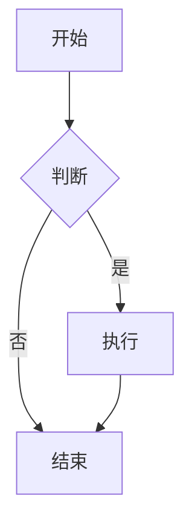

# 示例文章

这是一篇示例文章，展示如何在 `content` 目录下使用 Markdown 文件。

## 功能特性

- 支持完整的 Markdown 语法
- 支持代码高亮
- 支持数学公式
- 支持 Mermaid 图表
- 支持 Flowchart 流程图

## 代码示例

```javascript
function hello() {
  console.log('Hello, World!')
}
```

## 数学公式

行内公式：$E = mc^2$

块级公式：
$$
\int_{-\infty}^{\infty} e^{-x^2} dx = \sqrt{\pi}
$$

## Mermaid 图表



## 注意事项

1. 文件必须使用 `.md` 扩展名
2. Frontmatter 是可选的，但建议包含 `title` 和 `date`
3. 如果没有 frontmatter，系统会尝试从文件名提取信息

